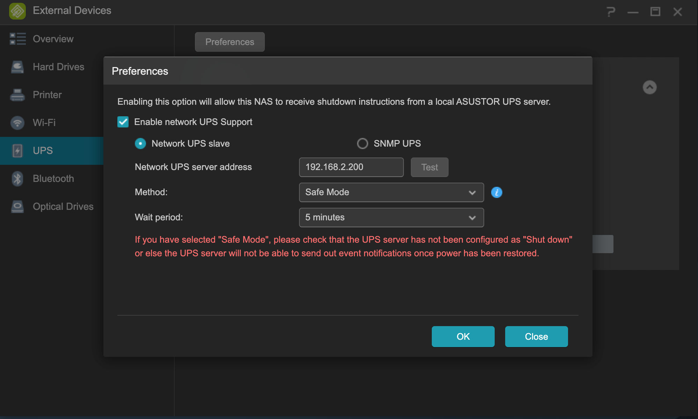
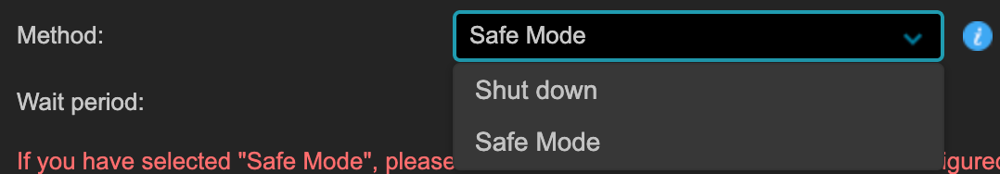
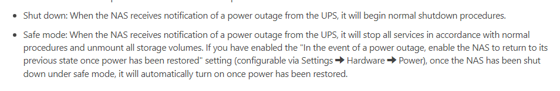
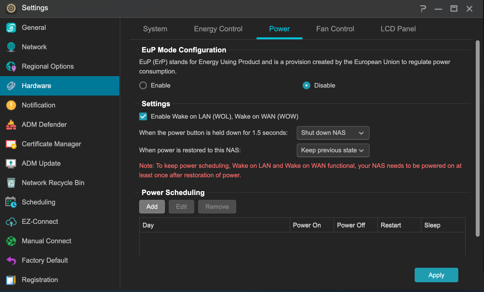
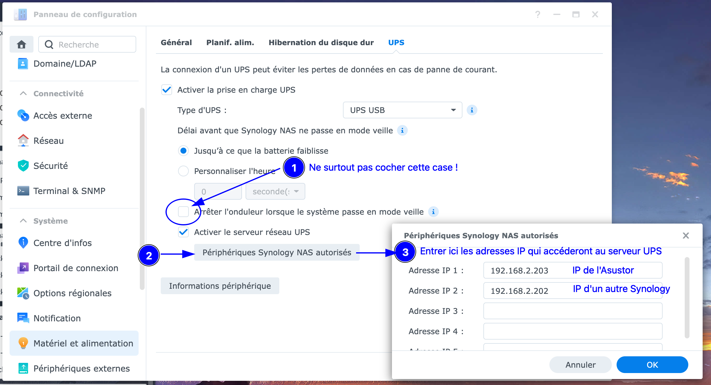
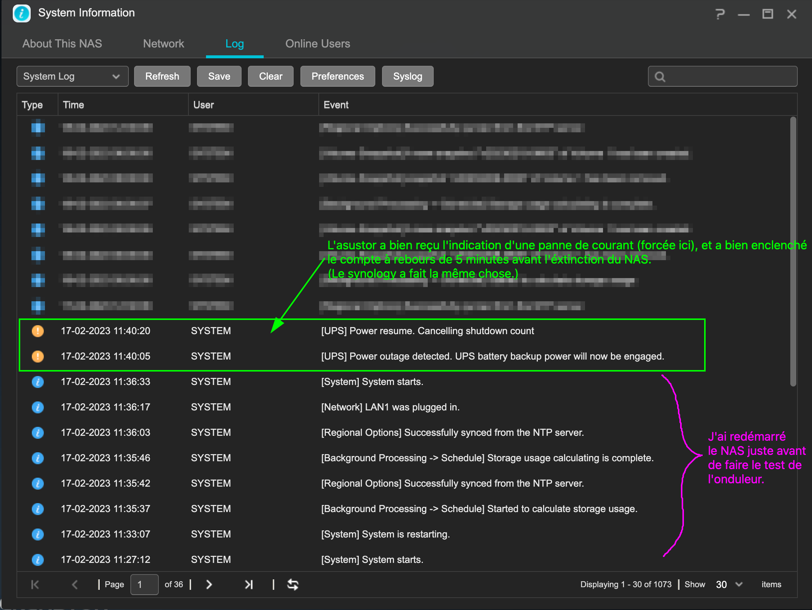

English | [French](README.fr.md)

# Use an UPS connected to a Synology NAS (master) with an Asustor NAS (slave) <!-- omit in toc -->

> **Objective**<br>
> Use, from an Asustor NAS, a "slave" inverter (UPS) which is connected via USB (therefore as master) on a Synology NAS with DSM 7.1.x, therefore as master on the Synology.

<br>

> **Note**
> <br>
> The following commands mostly need to be run as root in a terminal, remember to do: `sudo -i`

<br> 

> **Warning**
> <br>Attention, for the Asustor to properly receive the instructions from the UPS server, it is obvious that any transmission chain is placed on the inverter: the Synology NAS which acts as the UPS server, any switch to which the NAS is connected , and Asustor NAS.

<br>

> ***Topic on [forum-nas.fr](www.forum-nas.fr):***
>   
> - [Utiliser un onduleur connecté à un NAS Synology (maître) avec un NAS Asustor (esclave)](https://www.forum-nas.fr/)
> <br> &nbsp;

<hr>

> **Note**
>  <br>The following has been used successfully with the following NAS:
>  - Asustor AS6704T below ADM 4.2.0.RE71 
>  - Synology DS920+ below DSM 7.1.1-42962 Update 4


<hr>

### Table of contents <!-- omit in toc -->

- [I. Configuring the UPS as a slave in ADM](#i)
  - [I.1. Adding a network UPS](#i1)
  - [I.2. Configuring power management in ADM](#i2)
- [II. Configuring UPS as master in DSM](#ii)
- [III. SSH configuration of the UPS as a slave in the configuration files on the Asustor](#iii)
  - [III.1. Creation of the script which will backup and modify the `/etc/ups/` files](#iii1)
  - [III.2. Script explanations and getting started](#iii2)
    - [III.2.1. Some explanations](#iii21)
    - [III.2.2. Manual launch of the script to verify that everything is going well](#iii22)
    - [III.2.3. Creating a symbolic link from the script to `/usr/local/etc/init.d/`](#iii23)
- [IV. Inspiration for this tutorial](#iv)

<hr>


## I. Configuring the UPS as a slave in ADM <a name="i"></a>

### I.1. Adding a Network UPS <a name="i1"></a>

Begin by adding a connection to a UPS server in ADM. For that, you have to go to "***External Devices***", and configure as follows:
- Check the box "***Enable network UPS Support***";
- Choose "***Network UPS Slave***";
- Enter the IP address of the Synology NAS to which the inverter (UPS) is connected via USB;



It is possible to choose one of these two options:


I chose to use the "***Safe-Mode***" 5 minutes because it leaves 5 minutes before the NAS shuts down, because if it's on "Shutdown", the NAS will start the shutdown procedure as soon as it receives the information of the power failure.

This [is what Asustor's online help says](https://www.asustor.com/en/online/online_help?id=56):



Once the settings are made/chosen, you should get something like this:


It should be noted that we do not obtain information neither on the % of battery of the inverter, nor on the remaining duration. And even after you finish following the tutorial it will still be like this.
I did not manage to get this information in ADM... They are still visible in DSM on the Synology.

### I.2. Configuring Power Management in ADM <a name="i2"></a>

It is recommended not to activate the "***EuP Mode***":


I prefer to let the NAS return to its pre-power outage state as soon as the power is restored. So, if the NAS was on, when the power returns, it will restart.

---

## II. Configuring UPS as Master in DSM <a name="ii"></a>

In DSM, you must configure the UPS server as master for the inverter connected via USB.
Follow the instructions in the following screenshot:



The Asustor will now be able to access the connected UPS on the Synology.

> **Note**
> <br>It will also be necessary for the NAS firewall to authorize the connection from the asustor's IP to the UPS service. If necessary, create a dedicated rule.

---

## III. SSH configuration of the UPS as a slave in the configuration files on the Asustor <a name="iii"></a>

Here we attack the somewhat painful part, because you have to connect in SSH to the Asustor NAS.

Here I use my administrator account `User-Admin` to connect to the asustor whose IP is `192.168.2.203` on the custom port `1234` (these values ​​are to be changed by yours!):

```bash
ssh User-Admin@192.168.2.203 -p 1234
```

The file to modify is `/etc/ups/upsmon.conf`. And this file is reset each time the NAS is rebooted!

It will therefore be necessary to use a script that will be launched after each start of the NAS to modify this file, and to launch the few commands so that these modifications are taken into account.

### III.1. Creation of the script which will backup and modify the `/etc/ups/` files <a name="iii1"></a>

It is therefore necessary to create a script in a shared folder. I chose to place my various scripts in the `/share/docker/_scripts/` folder. If you use another location, you will have to modify this access path accordingly.

The script is called `partage-UPS-Synology-avec-NAS-Asustor.sh`, it will have to be placed in the chosen folder, via ADM for example.
(It is possible to use a command line editor like vi, or nano (to be installed with opkg, after installing the Entware package)).

The script: [partage-UPS-Synology-avec-NAS-Asustor.sh](https://raw.githubusercontent.com/MilesTEG1/Partage-UPS-Synology-avec-NAS-Asustor/main/partage-UPS-Synology-avec-NAS-Asustor.sh)

<details>
  <summary>Click here to view the script</summary>
  
  ```bash
  #!/bin/sh
  # Script de modification du fichier /etc/ups/upsmon.conf avec backup des fichiers contenus dans /etc/ups
  # Faire un:
  # chmod +x partage-UPS-Synology-avec-NAS-Asustor.sh

  # Pour que les modifications soient effectuées à chaque redémarrage, il faut faire un lien dans /usr/local/etc/init.d/
  #
  # ln -s /share/docker/_scripts/partage-UPS-Synology-avec-NAS-Asustor.sh /usr/local/etc/init.d/S84UPSpartageAvecSYNOLOGY
  #
  # init.d colle l'option 'start' à tout ce qui se nomme Sxxxx et 'stop' à tout ce qui se nomme 'Kxxx'

  #####################################################
  ## Variables
      NOM_UPS_Syno="ups"
      IP_Syno_UPS="192.168.2.200"
      USER_UPS="monuser"
      USER_MDP_UPS="secret"

      DEST_BACKUP=/home/User-Admin/UPS-CONF-Backup
  ##
  #####################################################

  UPS_CONF_PATH=/etc/ups

  CHAINE_FINALE="MONITOR $NOM_UPS_Syno@$IP_Syno_UPS 1 $USER_UPS $USER_MDP_UPS slave"

  # # DEBUT DEBUG:
  # UPS_CONF_PATH=/home/User-Admin
  # printf "\nChaine finale = "
  # echo $CHAINE_FINALE
  printf "\n--- Début du fichier upsmon.conf non modifié ---\n"
  cat $UPS_CONF_PATH/upsmon.conf
  printf "\n--- Fin du fichier upsmon.conf non modifié ---\n"
  # # FIN DEBUG

  # Copie backup des fichiers du dossier UPS_CONF_PATH
  mkdir -p $DEST_BACKUP
  sudo cp "$UPS_CONF_PATH"/* "$DEST_BACKUP"

  # Modification du fichier upsmon.conf pour utiliser en slave l'UPS branché en USB sur le Synology
  sudo sed -i "2s/.*/${CHAINE_FINALE}/" $UPS_CONF_PATH/upsmon.conf

  # DEBUT DEBUG:
  printf "\n--- Début du fichier upsmon.conf MODIFIÉ ---\n"
  cat $UPS_CONF_PATH/upsmon.conf
  printf "\n--- Fin du fichier upsmon.conf MODIFIÉ ---\n"
  # FIN DEBUG

  # Commands to restart the upsmon daemon:
  upsmon -c stop
  upsmon
  ```

  You will need to modify the following variables to match your configuration. Normally for a Synology NAS, only the `IP_Syno_UPS` and `DEST_BACKUP` variables will need to be modified.

  ```bash
  #####################################################
  ## Variables
      NOM_UPS_Syno="ups"
      IP_Syno_UPS="192.168.2.200"
      USER_UPS="monuser"
      USER_MDP_UPS="secret"

      DEST_BACKUP=/home/User-Admin/UPS-CONF-Backup
  ##
  #####################################################
  ```

</details>

### III.2. Script explanations and getting started <a name="iii2"></a>

#### III.2.1. Some explanations <a name="iii21"></a>

1. The script will build, using the variables set previously, the correct line that will allow the Asustor NAS to communicate with the UPS server on the Synology NAS.
2. The script will display the contents of the file that will be modified `/etc/ups/upsmon.conf`.
3. Then, if necessary, it will create the destination folder for the `DEST_BACKUP` backup, then copy the contents of the `/etc/ups/` folder into this `DEST_BACKUP` folder.
4. Then, with the `sed` command, it will modify only the second line of the `/etc/ups/upsmon.conf` file to change from:
   
   ```EditorConfig
   MONITOR asustor@192.168.2.200 1 admin 1111 slave
   ```
   
   to:
   
   ```EditorConfig
   MONITOR ups@192.168.2.200 1 monuser secret slave
   ```
   
   *The IP addresses will certainly be different.*
5. Then, it again displays the `upsmon.conf` file which has just been modified.
6. And finally, with the commands `upsmon -c stop` and `upsmon`, it will stop then restart the `upsmon` daemon in order to take into account the modifications made in the `upsmon.conf` file.

#### III.2.2. Manual launch of the script to verify that everything is going well <a name="iii22"></a>

We will manually launch the script to be sure that it correctly modifies the configuration file.

We therefore place ourselves in the folder containing it, and we make sure that it can be executed:

```bash
chmod +x partage-UPS-Synology-avec-NAS-Asustor.sh
```

Then we run it:

```bash
./partage-UPS-Synology-avec-NAS-Asustor.sh
```

We should see the contents of the file before the modification, then after the modification, then this:

```log
Network UPS Tools upsmon 2.7.2
kill: No such process
UPS: ups@192.168.2.200 (slave) (power value 1)
Using power down flag file /etc/killpower
```

This indicates that `upsmon` has been successfully connected to the synology UPS server in slave mode.

You can then do a crash test: cut off the power supply to the inverter connected to the Synology.

> **Warning**
> <br>Attention, for the Asustor to receive the instructions from the UPS server, it is obvious that any transmission chain is placed on the inverter: the Synology NAS which acts as the UPS server, the possible switch to which the ) NAS, and the Asustor NAS.

If everything went well, you should be able to observe this kind of event in the logs visible in "***System Information***":



#### III.2.3. Creating a symbolic link from the script to `/usr/local/etc/init.d/` <a name="iii23"></a>

Reminder: the script is placed in the folder chosen in [§-III.1.](#iii1-création-du-script-qui-va-soccuper-des-modifications-à-faire-et-aussi-de-sauvegarder-les-fichiers-de-etcups), for me it is: `/share/docker/_scripts/`.

You must make a symbolic link to `/usr/local/etc/init.d/` so that the script is launched each time the NAS is started.

> **Important**
> <br>The name of the link is very important, since if it begins with `Sxxx` it will be launched at startup, with the `start` option as a parameter (option which we will not use, and therefore not tested in the script) . If the link starts with `Kxxx` it will be launched at shutdown of the NAS, with the `stop` option, and we do not need a script that launches at shutdown for the UPS.

It is therefore necessary to launch the following command (remember to adapt the access path of the script `/share/docker/_scripts/partage-UPS-Synology-avec-NAS-Asustor.sh`:

```bash
ln -s /share/docker/_scripts/partage-UPS-Synology-avec-NAS-Asustor.sh /usr/local/etc/init.d/S84UPSpartageAvecSYNOLOGY
```

Here, the link is made, it only remains to reboot the NAS to see if the file is modified after the reboot.

Use the following command to check if the file has been modified:

```shell
cat /etc/ups/upsmon.conf
```

---
---

## IV. Inspiration for this tutorial <a name="iv"></a>

- [Network UPS Tools (NUT) Ultimate Guide #Linux NUT Client (remote)](https://docs.technotim.live/posts/NUT-server-guide/#linux-nut-client-remote)
- [Use Synology NAS as UPS Server to safely power down your other servers/computers](https://www.reddit.com/r/synology/comments/gtkjam/use_synology_nas_as_ups_server_to_safely_power/)
- [How To: Create a usable pool/volume to use as storage using NVMe(s) in the M.2 slots on the DS920+ (and others) running DSM 7 # Synology Server](https://kb.xnaas.info/en/public/synology/ups/#synology-server)
